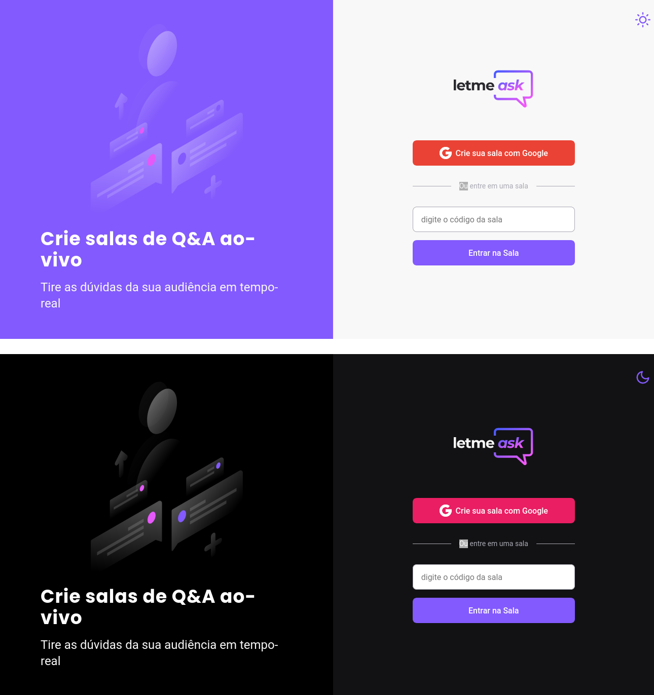

<p align="center">
  
</p>


<h1 align="center">
    
</h1>

<br>

## Technologies

This project was developed using the following technologies:

- [React](https://reactjs.org)
- [Firebase](https://firebase.google.com/)
- [TypeScript](https://www.typescriptlang.org/)

## Getting started

Clone the project and access the folder.

```bash
$ git clone https://github.com/charles-mrt/letme-Ask.git
$ cd letmeask
```

Follow the steps below:
```bash
# Install the dependencies
$ yarn

# Start the project
$ yarn start
```
The app will be available for access on your browser at http://localhost:3000

firebase rules required for the project:
- [Firebase rules](https://gist.github.com/charles-mrt/d48256abbd8ce748c6d09af3e79dba83) 

## Layout

You can view the project layout through the links below:

- [Layout Web](https://www.figma.com/file/wIrvL41S7kP5MWFkxs527g/Letmeask-nlw-charles-Copy) 

Remembering that you need to have a [Figma](http://figma.com/) account to access it.

## License

This project is licensed under the MIT License. See the [LICENSE](https://github.com/charles-mrt/letme-Ask/blob/master/LICENSE) file for details.


---

<p align="center">Made by Charles Martins</p>